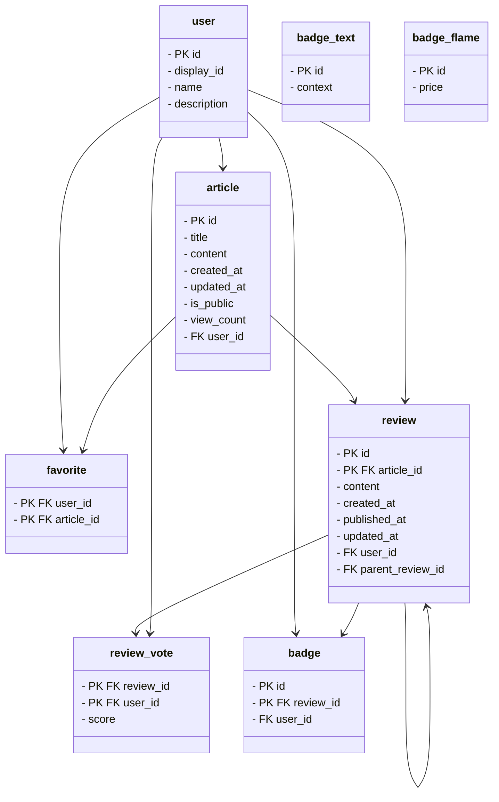

```mermaid
classDiagram
  user --> article
  user --> favorite
  article --> favorite
  article --> review
  user --> review
  review --> review_vote
  user --> review_vote
  review --> review
  user --> badge
  review --> badge

  class user{
    - PK id
    - display_id
    - name
    - description
  }

  class article{
  - PK id
  - title
  - content
  - created_at
  - updated_at
  - is_public
  - view_count
  - FK user_id
  }

  class favorite{
  - PK FK user_id
  - PK FK article_id
  }

  class review{
  - PK id
  - PK FK article_id
  - content
  - created_at
  - published_at
  - updated_at
  - FK user_id
  - FK parent_review_id
  }

  class review_vote{
  - PK FK review_id
  - PK FK user_id
  - score
  }

  class badge{
  - PK id
  - PK FK review_id
  - FK user_id 
  }

  class badge_text {
  - PK id
  - context
  }

  class badge_flame {
  - PK id
  - price
  }
```
